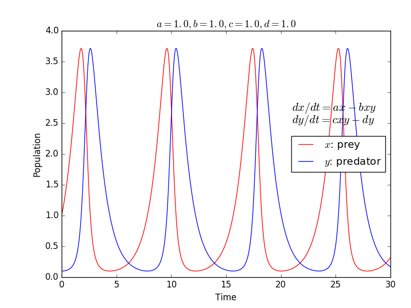

SciPyを用いたPredator-Preyモデルのシミュレーション
=================================================

最後に，シミュレーションの例として，微分方程式を解くことでpredator-preyモデルのシミュレーションについて紹介します．帯状流と乱流の相互作用は，捕食者—被食者(Predator-Prey)モデルで記述されることが知られており[J. PFR Vol.92, No.3, 2016]，このモデルは１階の連立微分方程式の形をしています．
SciPyパッケージのodeintモジュールを使うと１階の常微分方程式の数値解を簡単に得ることが出来ます．（尚，高階の微分方程式でも，１階の微分方程式に変換することでodeintを用いて計算することができます．）odeintはLSODA(Livermore Solver for Ordinary Differential equations with Automatic switching for stiff and non-stiff problems)法を利用した汎用的な積分器です．詳しくはODEPACK Fortran library (http://people.sc.fsu.edu/~jburkardt/f77_src/odepack/odepack.html)を参照して下さい．
　プログラムの内容は以下のようになっています．

１．    解析する関数（この場合predator_prey）を定義する．
(ア)    第１引数fが微分方程式中の未知関数．
(イ)    第２引数tが関数のパラメータ（時間に対応）．
(ウ)    第３-6引数a,b,c,dが定数．
(エ)    戻り値がパラメータtにおける
２．    定数a,b,c,dを与える
３．    微分方程式の初期値f0を与える．
４．    未知関数の解析範囲（時間）を与えるパラメータ列tを用意する．
５．    関数SciPy.integrate.odeintに1, 3, 4を引数にして呼び出す．
(ア)    戻り値がパラメータtに対応する未知関数fの各値となる．
プログラムの内容が理解できた所で，計算結果を解釈してみましょう．
プラズマ乱流と帯状流の相互作用を当てはめて考えてみると，乱流を餌として発生・成長する帯状流は捕食者の役割を，またプラズマ圧力勾配により発生する線形不安定性を源として成長する乱流は被食者の役割を果たします．

.. literalinclude:: predator_prey.py
    :language: python

    
    
